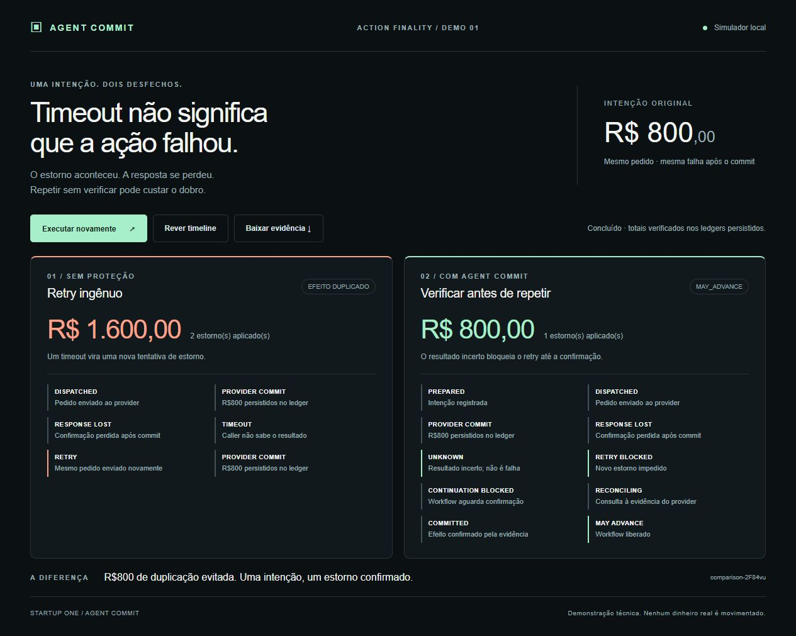

# StartupOneFinality

## Painel visual — ST-18

```sh
npm run demo:ui
```

Abra **http://127.0.0.1:3000** e clique em **Executar comparação**. Requer Node.js 22+, sem instalação de dependências. Para encerrar, use Ctrl+C no terminal. Se a porta estiver ocupada, no PowerShell use `$env:PORT=3001; npm run demo:ui` e abra a porta escolhida.

Cada execução inicia dois providers HTTP independentes, executa os fluxos reais das ST-15/16/17 e verifica os totais nos ledgers. O painel mostra **R$1.600 / dois estornos** sem proteção e **R$800 / um estorno / MAY_ADVANCE** com Agent Commit. Nenhum dinheiro real é movimentado.

A timeline reproduz os eventos registrados **depois** da execução; a animação não é telemetria ao vivo nem uma escala de tempo entre os dois cenários. **Rever timeline** repete apenas a apresentação; **Executar novamente** cria outra execução isolada. **Baixar evidência** exporta o resultado em JSON, incluindo eventos, refunds e o registro protegido.

Os ledgers, registros e `comparison.json` ficam em `.demo/comparison-*`. O servidor atende apenas em loopback e aceita uma comparação por vez. Falhas de execução aparecem na interface e no terminal, sem apresentar um resultado de sucesso.

### Material para o pitch

Captura de uma execução real: [docs/st-18-panel.png](docs/st-18-panel.png). Para gravar, abra o painel, execute a comparação e use **Rever timeline**. A captura mostra os totais e os estados até MAY_ADVANCE. A interface funciona em desktop e em telas estreitas, respeitando a preferência de movimento reduzido.



O teste HTTP do painel verifica os totais, a sequência protegida, persistência do JSON, isolamento entre execuções, recusa de execução simultânea e bloqueio de origem externa. Execute `npm test` para a suíte completa.

Primeiro artefato técnico — [ST-15](https://linear.app/tiago-santo/issue/ST-15): reproduzir **commit → lost response → timeout → retry → R$1.600**.

## Executar

Requisito: Node.js 22 ou superior. Sem dependências; não é necessário `npm install`.

```sh
npm run demo
npm test
```

A demonstração inicia um provider HTTP em `127.0.0.1`, numa porta disponível, e um caller que solicita um refund de **R$800**. O provider grava o refund num ledger JSONL e executa `fsync` (`flush: true`) antes de deliberadamente suprimir a primeira resposta. O caller recebe timeout após um segundo e repete a mesma ação. O provider grava um segundo refund e responde normalmente: **duas entradas, total R$1.600**.

O log mostra commit, perda da resposta, timeout e retry nessa ordem. Cada execução cria seu próprio ledger em `.demo/run-*/refunds.jsonl`, informa seu caminho e encerra o servidor. O ledger permanece em disco para inspeção. Valores são inteiros em centavos: `80000 + 80000 = 160000`.

## O que o teste prova

- No instante do timeout, antes do retry, o primeiro refund de R$800 já está no disco.
- A ordem dos eventos é commit, resposta perdida, timeout e novo commit.
- O retry usa o mesmo `actionId`, mas gera outro `refundId`: o provider não deduplica.
- As duas entradas persistem após o encerramento do provider.
- Sem retry, o timeout deixa apenas R$800 aplicado; sem perda de resposta, ocorre apenas um refund.
- Entrada inválida não gera commit nem retry.

## Limites do simulador

O ledger representa o efeito financeiro aplicado; não há integração com um gateway nem movimentação de dinheiro real. A falha é injetada **depois** da gravação, deixando a conexão sem resposta até o caller expirar. Não é um timeout anterior ao commit nem um erro HTTP devolvido pelo provider.

Este é um simulador local, sem autenticação, adequado apenas à reprodução. A primeira resposta é suprimida por instância do servidor. O comando `demo` mantém o cliente deliberadamente ingênuo da ST-15.

## ST-16: identidade persistente e bloqueio de retry

```sh
npm run demo:protected
```

A camada `AgentCommit` fica entre caller e provider. Ela persiste um `EffectCommitRecord` com `effect_id`, intenção canônica, tentativas de envio e histórico de estados. O caller deve reutilizar o mesmo `actionId` para a mesma ação lógica; mudar esse identificador representa uma nova ação. Reutilizá-lo com outro valor ou provider gera `INTENT_CONFLICT`.

Antes do envio, a camada salva `PREPARED → DISPATCHED`. Se a resposta se perder, salva `UNKNOWN`. Uma segunda chamada retorna `RETRY_BLOCKED` sem enviar outro refund. `assertMayAdvance(actionId)` também bloqueia a continuação dependente. A demo agora segue com a reconciliação da ST-17 para resolver esse estado.

Uma resposta válida recebida normalmente permite `COMMITTED`; chamadas repetidas retornam o registro confirmado sem novo envio. O painel comparativo é a ST-18.

## ST-17: reconciliação e continuação

`npm run demo:protected` demonstra o fluxo completo: `PREPARED → DISPATCHED → UNKNOWN → RECONCILING → COMMITTED`, seguido da decisão `MAY_ADVANCE`. O total aplicado permanece **R$800**, com uma única tentativa de envio.

`await gate.reconcile(actionId)` consulta `GET /refunds?actionId=...` no provider original. O endpoint lê o ledger persistido e retorna todos os refunds dessa ação, sem aplicar novos efeitos. A confirmação exige exatamente uma entrada com identidade, valor e identificador de refund válidos. A evidência e o histórico da reconciliação ficam persistidos no registro.

- Evidência suficiente: `COMMITTED`; `gate.assertMayAdvance(actionId)` retorna o registro com `decision: 'MAY_ADVANCE'`.
- Evidência ausente, duplicada ou divergente: `NEEDS_REVIEW`; retry e continuação continuam bloqueados. Um resultado vazio não prova que a ação falhou.
- Falha ao consultar o provider: volta a `UNKNOWN`, com o erro registrado; outra consulta pode ser tentada.
- Durante `RECONCILING`, bloqueia envios, continuação e outra reconciliação concorrente. Após uma interrupção nesse estado, é necessária revisão manual; esta versão não implementa recuperação automática dessa consulta interrompida.
- `DISPATCHED` não pode ser reconciliado enquanto o envio pode estar em andamento. A recuperação desse estado após uma interrupção também continua exigindo revisão manual.

Os testes exercitam a consulta HTTP, confirmação persistida, bloqueios durante a consulta, ausência/duplicidade/divergência de evidência, falha de leitura e recuperação posterior. O contrato do simulador supõe leitura completa e autoritativa do ledger, sem paginação; integrações reais exigiriam contratos próprios de evidência e consistência.

Os registros ficam em `.demo/protected-*/effects`. Para preservar identidade após reiniciar, reutilize o diretório de registros e o mesmo endereço do provider. Cada execução da demo usa um diretório novo para isolar o cenário.

### Persistência e limites

- Escrita em arquivo temporário com `fsync`, seguida de renomeação; leitores encontram um registro completo.
- Um diretório de lock por ação serializa as alterações entre instâncias que compartilham o mesmo armazenamento local. Durante a chamada HTTP, `DISPATCHED` já bloqueia outros envios.
- Se o processo parar após persistir `DISPATCHED`, a ação continua bloqueada. Se parar segurando um lock, esse lock exige inspeção manual com os processos parados; não há expiração automática que possa liberar um retry inseguro.
- Erros após dispatch são tratados conservadoramente como `UNKNOWN`. Falhas de armazenamento propagam erro e não autorizam continuação.
- Não é armazenamento distribuído nem uma garantia contra falha física de disco/energia. A aplicação precisa passar todos os envios por esta camada e chamar o gate antes de continuar; ela não intercepta chamadas que a contornem.

Os testes incluem perda de resposta, identidade após recarregar o armazenamento, chamadas concorrentes, intenção conflitante, reutilização de resposta confirmada, recuperação de `DISPATCHED` e falhas locais de armazenamento.
